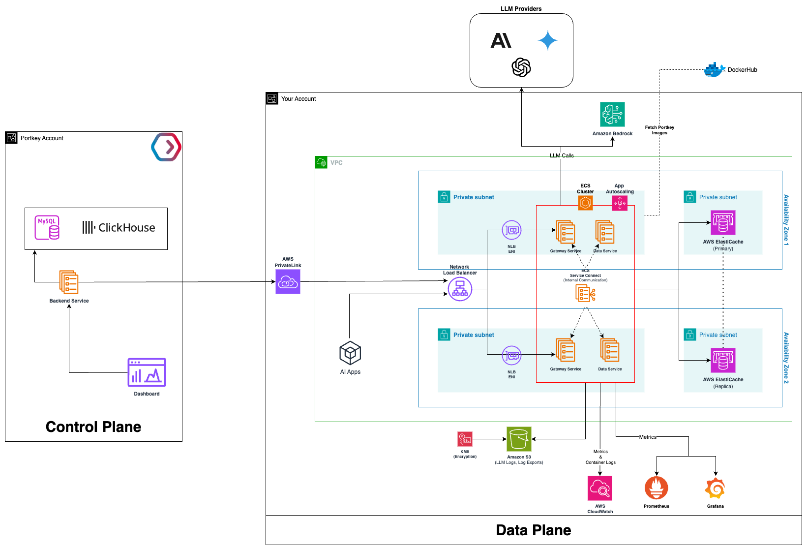

# Portkey Gateway - Amazon ECS Deployment

This enterprise-focused deployment guide provides comprehensive instructions for deploying Portkey Gateway on Amazon ECS clusters. Designed to meet the needs of large-scale, mission-critical applications, this guide includes specific recommendations for component sizing, high availability, and integration with monitoring systems.

## Architecture

*Figure 1: Overview of the Portkey Gateway deployment with Control Plane and Data Plane components.*

## Components and Sizing Recommendations

| Component                               | Options                                                                   | Sizing Recommendations                                                                                                                                              |
| --------------------------------------- | ------------------------------------------------------------------------- | ------------------------------------------------------------------------------------------------------------------------------------------------                    |
| AI Gateway                              | Deploy in your ECS cluster using terraform project.                       | Use Amazon ECS t4g.medium worker nodes, each providing at least 2 vCPUs and 4 GiB of memory. For high availability, deploy them across multiple Availability Zones. |
| Logs Store (optional)                   | Amazon S3 or S3-compatible Storage                                        | Each log document is ~10kb in size (uncompressed)                                                                                                                  |
| Cache (Prompts, Configs & Providers)    | Built-in Redis, Amazon ElastiCache for Redis OSS or Valkey                | Deployed within the same VPC as the Portkey Gateway.                                                                                                                |

## Prerequisites

Ensure that following tools and resources are installed and available:

* The [Terraform CLI](https://developer.hashicorp.com/terraform/tutorials/aws-get-started/install-cli) installed.
* [AWS CLI](https://docs.aws.amazon.com/cli/latest/userguide/getting-started-install.html) installed and configured.
* AWS Account with appropriate permissions

## Create a Portkey Account

1. Go to the [Portkey](https://portkey.ai) website.
2. Sign up for a Portkey account.
3. Once logged in, locate and save your `Organisation ID` for future reference. You can find it in the browser URL:
   `https://app.portkey.ai/organisation/<organisation_id>/`
4. Contact the Portkey AI team and provide your Organisation ID and the email address used during signup.
5. The Portkey team will share the following information with you:
    - Docker credentials for the Gateway images (**username** and **password**).
    - License: **Client Auth Key**.

## Clone Portkey Repository

Clone the Portkey repository containing the terraform project for deploying Portkey Gateway on ECS.

```bash
git clone https://github.com/Portkey-AI/portkey-gateway-infrastructure
cd portkey-gateway-infrastructure/terraform
```

## Store Secrets in AWS Secrets Manager

Use the AWS CloudFormation template to create secrets in AWS Secrets Manager. These secrets will store your Docker credentials, client authentication keys, and other sensitive information.

1. Go [AWS CloudFormation Console](https://us-east-1.console.aws.amazon.com/cloudformation/home?region=us-east-1#/stacks/create) to create the stack.
2. Under **Specify template**, select **Upload a template file**, then upload the `secrets.yaml` template located in the `portkey-gateway-infrastructure/cloudformation/` directory.
3. On the next page, provide the following parameters:
    - **Project Details**
        - Project Name — e.g., `portkey-gateway`
        - Environment — e.g., `dev` or `prod`
    - **Image Credentials**
        - Docker Username - *Provided by Portkey*
        - Docker Password - *Provided by Portkey*
    - **Portkey Integration**
        - Portkey Client Auth - *Provided by Portkey*
        - Organizations - The organization ID obtained after signing up for your Portkey account.
4. Click **Submit** to launch the stack and provision the required resources.
5. After the stack is successfully created, navigate to the **Outputs** section and record the following details.
    - **DockerCredentialsSecretArn**
    - **ClientOrgSecretNameArn**

## Configuration Variables

Navigate to `portkey-gateway-infrastructure/terraform/environments/dev` and update the `dev.tfvars` file to specify your project configuration details. The table below describes all Terraform variables available in this deployment:

| Variable Name | Default | Required | Description |
|--------------|---------|----------|-------------|
| **Project Details** | | | |
| `project_name` | `"portkey"` | No | Name of the Project |
| `environment` | `"dev"` | No | Deployment environment (e.g., dev, prod) |
| `aws_region` | - | **Yes** | AWS region to deploy resources in |
| `environment_variables_file_path` | - | **Yes** | Relative path to the `environment-variables.json` file containing environment variables for the services. <br>For example:    `"environments/dev/environment-variables.json"` |
| `secrets_file_path` | - | **Yes** | Relative path to the `secrets.json` file containing environment variables for the services. <br>For example: `"environments/dev/secrets.json"` |
| **Network Configuration** | | | |
| `create_new_vpc` | - | **Yes** | Set to true to create a new VPC. Set to false to use an existing one |
| `vpc_cidr` | `null` | Conditional* | CIDR block for the new VPC (required if `create_new_vpc = true`) |
| `num_az` | `2` | No | Number of Availability Zones to use (relevant if `create_new_vpc = false`)<br>**Recommended:** at least 2 for high availability |
| `single_nat_gateway` | `true` | No | When true, creates a single NAT Gateway shared across all private subnets, otherwise 1 NAT Gateway per AZ (relevant if `create_new_vpc = false`) |
| `vpc_id` | `null` | Conditional* | ID of the existing VPC (required if `create_new_vpc = false`) |
| `public_subnet_ids` | `[]` | Conditional* | List of public subnet IDs (required if `create_new_vpc = false`) |
| `private_subnet_ids` | `[]` | Conditional* | List of private subnet IDs (required if `create_new_vpc = false`) |
| **Cluster and Capacity Provider** | | | |
| `create_cluster` | `true` | No | Set to true to create a new ECS cluster. Set to false to use an existing one |
| `cluster_name` | `null` | Conditional* | Name of the cluster (must be provided if `create_cluster = false`) |
| `capacity_provider_name` | `null` | Conditional* | Name of the cluster capacity provider (must be provided if `create_cluster = false`) |
| `instance_type` | `"t4g.medium"` | No | EC2 instance type to associate with autoscaling group (relevant if `create_cluster = true`) |
| `max_asg_size` | `3` | No | Maximum number of EC2 in auto scaling group (relevant if `create_cluster = true`) |
| `min_asg_size` | `1` | No | Minimum number of EC2 in auto scaling group (relevant if `create_cluster = true`) |
| `desired_asg_size` | `2` | No | Desired number of EC2 in auto scaling group (relevant if `create_cluster = true`) |
| `target_capacity` | `70` | No | Desired percentage of cluster resources that ECS aims to maintain (relevant if `create_cluster = true`) |
| **Docker Image Configuration** | | | |
| `gateway_image` | `{image="portkeyai/gateway_enterprise", tag="latest"}` | No | Container image to use for the gateway |
| `data_service_image` | `{image="portkeyai/data-service", tag="latest"}` | No | Container image to use for the data service |
| `docker_cred_secret_arn` | - | **Yes** | ARN of AWS Secrets Manager's secret where docker credentials shared by Portkey is stored |
| `redis_image` | `{image="redis", tag="7.2-alpine"}` | No | Container image to use for Redis |
| **Gateway Service Configuration** | | | |
| `gateway_desired_task` | `1` | No | Number of tasks to run in Gateway Service |
| `gateway_cpu` | `256` | No | CPU associated with Gateway Service tasks |
| `gateway_memory` | `1024` | No | Memory associated with Gateway Service tasks |
| `gateway_enable_autoscaling` | `false` | No | Set to `true` to enable autoscaling on Gateway Service |
| `gateway_min_capacity` | `1` | No | Minimum number of tasks to run Gateway Service (relevant if `gateway_enable_autoscaling = true`) |
| `gateway_max_capacity` | `3` | No | Maximum number of tasks to run Gateway Service (relevant if `gateway_enable_autoscaling = true`) |
| `gateway_target_cpu_utilization` | `null` | No | % CPU utilization that ECS autoscaling should try to maintain (relevant if `gateway_enable_autoscaling = true`) |
| `gateway_target_memory_utilization` | `null` | No | % memory utilization that ECS autoscaling should try to maintain (relevant if `gateway_enable_autoscaling = true`) |
| `gateway_scale_in_cooldown` | `120` | No |  Amount of time (seconds) wait after a scale in activity before another scale in activity can start (relevant if `gateway_enable_autoscaling = true`) |
| `gateway_scale_out_cooldown` | `60` | No |  Amount of time (seconds) wait after a scale out activity before another scale out activity can start (relevant if `gateway_enable_autoscaling = true`) |
| **Data Service Configuration** | | | |
| `enable_dataservice` | `false` | No | Set to true to deploy Data Service |
| `dataservice_desired_task` | `1` | No | Number of tasks to run in Gateway Service |
| `dataservice_cpu` | `256` | No | CPU associated with Gateway Service tasks |
| `dataservice_memory` | `1024` | No | Memory associated with Gateway Service tasks |
| `dataservice_enable_autoscaling` | `false` | No | Set to `true` to enable autoscaling on Gateway Service |
| `dataservice_min_capacity` | `1` | No | Minimum number of tasks to run Gateway Service (relevant if `dataservice_enable_autoscaling = true`) |
| `dataservice_max_capacity` | `3` | No | Maximum number of tasks to run Gateway Service (relevant if `dataservice_enable_autoscaling = true`) |
| `dataservice_target_cpu_utilization` | `null` | No | % CPU utilization that ECS autoscaling should try to maintain (relevant if `dataservice_enable_autoscaling = true`) |
| `dataservice_target_memory_utilization` | `null` | No | % memory utilization that ECS autoscaling should try to maintain (relevant if `dataservice_enable_autoscaling = true`) |
| `dataservice_scale_in_cooldown` | `120` | No |  Amount of time (seconds) wait after a scale in activity before another scale in activity can start (relevant if `dataservice_enable_autoscaling = true`) |
| `dataservice_scale_out_cooldown` | `60` | No |  Amount of time (seconds) wait after a scale out activity before another scale out activity can start (relevant if `dataservice_enable_autoscaling = true`) |
| **Redis Configuration** | | | |
| `redis_type` | `"redis"` | No | Set to `aws-elasti-cache` to use AWS ElastiCache as the cache store, or to `redis` to use the built-in containerized redis instance. |
| `redis_endpoint` | `""` | Conditional* | Specify AWS ElastiCache Endpoint** (required if `redis_type = aws-elasti-cache`)  |
| `redis_cpu` | `256` | No | Specify CPU for redis task (relevant if `redis_type = redis`)  |
| `redis_memory` | `1024` | No | Specify memory for redis task (relevant if `redis_type = redis`)  |
| `redis_tls_enabled` | `false` | No | Specify if TLS is enabled on AWS ElastiCache instance |
| `redis_mode` | `"standalone"` | No | Set `cluster` if clustering mode is enabled on AWS ElastiCache instance |
| **Log Store Configuration** | | | |
| `object_storage` | - | **Yes** | Specify log stores (object with: log_store_bucket, log_exports_bucket, finetune_bucket, bucket_region) |
| `enable_bedrock_access` | `false` | No | Enable access to Bedrock |
| **Load Balancer Configuration** | | | |
| `create_nlb` | `true` | No | Create Network Load Balancer? |
| `internal_nlb` | `true` | No | Create internal load balancer or internet-facing |
| `allowed_nlb_cidrs` | `[]` | No | Provide IP ranges to whitelist in NLB security group |
| `tls_certificate_arn` | `""` | No | ACM certificate ARN to enable TLS-based listeners |
| `enable_blue_green` | `false` | No | Define whether to configure blue-green deployment for gateway with load balancer |

*Conditional: Required based on other variable values (see description for conditions)

** If cluster mode is enabled in ElastiCache then use **Configuration Endpoint** otherwise use **Primary Endpoint**. For more information on ElastiCache endpoints, refer to the [AWS documentation](https://docs.aws.amazon.com/AmazonElastiCache/latest/dg/Endpoints.html).

## Quick Start

1. Clone this repository
2. Navigate to the terraform directory: `cd terraform`
3. Review and update `environments/dev/dev.tfvars` with your configuration
4. Initialize Terraform: `terraform init -backend-config=environments/dev/backend.config`
5. Plan the deployment: `terraform plan -var-file=environments/dev/dev.tfvars`
6. Apply the configuration: `terraform apply -var-file=environments/dev/dev.tfvars`

## Deploying Portkey Gateway

### Setup Remote S3 Backend

To manage Terraform state securely and enable collaboration across teams, it's recommended to configure a remote backend. Modify the `backend.config` file located in the `terraform/environments/dev` directory.

```hcl
# Replace "<S3_BUCKET_NAME>" with s3 bucket name where terraform state file will be stored.
bucket = "<S3_BUCKET_NAME>"

# Replace "<S3_KEY_PATH>" with key where terraform state file will be written to (e.g., dev/portkey-gateway/terraform.tfstate).
key = "<S3_KEY_PATH>"

# Replace "<AWS_REGION>" with AWS region in which S3 bucket resides (e.g., us-east-1).
region = "<AWS_REGION>"
```

### Initialize Terraform

```bash
cd terraform
terraform init -backend-config=environments/dev/backend.config
```

### Create Terraform Plan

```bash
terraform plan -var-file=environments/dev/dev.tfvars -out=environments/dev/tfplan
```

### Deploy Terraform Plan

Apply the tfplan created in last step to deploy the Gateway resources.

```bash
terraform apply environments/dev/tfplan
```

After a successful deployment, the output will include the DNS name of the created Network Load Balancer. Make sure to note it down for use in later testing.

## Verify the Deployment

To confirm that the deployment was successful, follow these steps:

- Navigate to your Amazon ECS cluster and confirm that the tasks for each created service are running and in a healthy state.

  **Note:** If tasks are in unhealthy state, inspect the Service logs to diagnose potential issues.

- Test Gateway by sending a sample cURL request.

  ```bash
  # Specify LLM provider and Portkey API keys
  export OPENAI_API_KEY=<OPENAI_API_KEY>
  export PORTKEY_API_KEY=<PORTKEY_API_KEY>
  
  # Replace <NETWORK_LOAD_BALANCER_DNS> and <LB_LISTENER_PORT_NUMBER> with the DNS name and listener port of the created load balancer, respectively.
  curl 'http://<NETWORK_LOAD_BALANCER_DNS>:80/v1/chat/completions' \
  -H "Content-Type: application/json" \
  -H "Authorization: Bearer $OPENAI_API_KEY"  \
  -H "x-portkey-provider: openai" \
  -H "x-portkey-api-key: $PORTKEY_API_KEY"  \
  -d '{
      "model": "gpt-4o-mini",
      "messages": [{"role": "user","content": "What is a fractal?"}]
  }'
  ```

## Integrating Gateway with Control Plane

Portkey supports the following methods for integrating the Control Plane with the Data Plane/Gateway:
- AWS PrivateLink
- IP Whitelisting

For detailed integration instructions, refer to the [full documentation](https://portkey.ai/docs).

## Directory Structure

```
portkey-gateway/
├── architecture
├── cloudformation/
│   ├── secrets.yaml                        # CloudFormation template for creating secrets in AWS Secrets Manager
├── terraform/
│   ├── environments/
│   │   ├── dev/                            # Development environment
│   │   │   ├── dev.tfvars                  # dev input variables
│   │   │   ├── environment-variables.json  # Environment variables for services
│   │   │   └── backend.config              # Remote S3 Backend configuration for Terraform state
│   │   └── prod/                           # Production environment
│   ├── modules/
│   │   └── ecs-service/                    # Reusable ECS service module
│   ├── *.tf                                # Main Terraform configuration files
│   └── variables.tf                        # Variable definitions
└── README.md                               # This file
```

## Notes

- Variables marked as "Conditional" have validation rules that depend on other variables. For example, `vpc_cidr` is required when `create_new_vpc` is true, but not when it's false.
- Default values are shown where applicable. Variables without defaults are required unless they have conditional logic.

## Uninstalling Portkey Gateway

```bash
terraform destroy -var-file="environments/dev/dev.tfvars"
```
