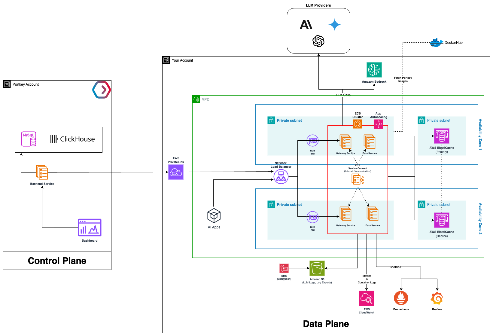

# Portkey Gateway - Amazon ECS Deployment

This guide provides comprehensive instructions for deploying Portkey Gateway on Amazon ECS clusters with support for high availability, auto-scaling, and multiple deployment strategies (Rolling, Blue/Green, Canary, Linear).

## Table of Contents
- [Components and Sizing](#components-and-sizing-recommendations)
- [Architecture](#architecture)
- [Prerequisites](#prerequisites)
- [Deployment Guide](#deployment-guide)
- [Integration with Control Plane](#integration-with-control-plane)
- [Uninstalling](#uninstalling-portkey-gateway)

## Components and Sizing Recommendations

| Component                               | Options                                                                   | Sizing Recommendations                                                                                                                                              |
| --------------------------------------- | ------------------------------------------------------------------------- | ------------------------------------------------------------------------------------------------------------------------------------------------                    |
| AI Gateway                              | Deploy in your ECS cluster using terraform project.                       | Use Amazon ECS t4g.medium worker nodes, each providing at least 2 vCPUs and 4 GiB of memory. For high availability, deploy them across multiple Availability Zones. |
| Logs Store (optional)                   | Amazon S3 or S3-compatible Storage                                        | Each log document is ~10kb in size (uncompressed)                                                                                                                  |
| Cache (Prompts, Configs & Providers)    | Built-in Redis, Amazon ElastiCache for Redis OSS or Valkey                | Deployed within the same VPC as the Portkey Gateway.                                                                                                                |

## Architecture



*Figure 1: Portkey Gateway hybrid deployment architecture on AWS ECS*

### ECS Infrastructure Features
- ✅ Automated VPC and networking setup
- ✅ High availability across multiple AZs
- ✅ Auto-scaling based on CPU/memory utilization
- ✅ Multiple deployment strategies (Rolling, Blue/Green, Canary, Linear)
- ✅ Deployment circuit breaker with automatic rollback
- ✅ CloudWatch logging and monitoring
- ✅ Secrets management with AWS Secrets Manager

## Prerequisites

Before deploying Portkey Gateway on AWS ECS, ensure you have:

### Required
* **Portkey Account**: Sign up at [portkey.ai](https://portkey.ai) to get your Organization ID and credentials
* **AWS Account** with permissions for:
  - Amazon ECS (Elastic Container Service)
  - Amazon EC2 (for ECS worker nodes)
  - Amazon VPC (Virtual Private Cloud)
  - Application/Network Load Balancers
  - IAM (Identity and Access Management)
  - S3 (for logs and state storage)
  - CloudWatch (for logging)
* **Terraform CLI**: [Install Terraform](https://developer.hashicorp.com/terraform/tutorials/aws-get-started/install-cli) (v1.13+)
* **AWS CLI**: [Install and configure](https://docs.aws.amazon.com/cli/latest/userguide/getting-started-install.html) with credentials

## Deployment Guide

Follow these steps to deploy Portkey Gateway on AWS ECS.

### Step 1: Create Portkey Account

1. Sign up at [portkey.ai](https://portkey.ai)
2. Once logged in, locate your `Organisation ID` in the browser URL:
   ```
   https://app.portkey.ai/organisation/<organisation_id>/
   ```
3. Contact the Portkey team with your Organisation ID and email address
4. The Portkey team will provide:
   - Docker credentials (username and password)
   - Client Auth Key (license)

### Step 2: Clone the Repository

```bash
git clone https://github.com/Portkey-AI/portkey-gateway-infrastructure
cd portkey-gateway-infrastructure/terraform/ecs
```

### Step 3: Store Secrets in AWS Secrets Manager

Use the AWS CloudFormation template to create secrets in AWS Secrets Manager. These secrets will store your Docker credentials, client authentication keys, and other sensitive information.

1. Go to the [AWS CloudFormation Console](https://us-east-1.console.aws.amazon.com/cloudformation/home?region=us-east-1#/stacks/create) to create the stack.
2. Under **Specify template**, select **Upload a template file**, then upload the `secrets.yaml` template located in the `portkey-gateway-infrastructure/cloudformation/` directory.
3. On the next page, provide the following parameters:
    - **Project Details**
        - Project Name — e.g., `portkey-gateway`
        - Environment — e.g., `dev` or `prod`
    - **Image Credentials**
        - Docker Username - *Provided by Portkey*
        - Docker Password - *Provided by Portkey*
    - **Portkey Integration**
        - Portkey Client Auth - *Provided by Portkey*
        - Organizations - The organization ID obtained after signing up for your Portkey account.
4. Click **Submit** to launch the stack and provision the required resources.
5. After the stack is successfully created, navigate to the **Outputs** section and record the following details:
    - `DockerCredentialsSecretArn`
    - `ClientOrgSecretNameArn`

### Step 4: Update Environment Variables

Gateway containers require certain configuration details to be provided through environment variables — for example, ClientAuth, your Portkey account organization_id, the analytics store being used, and whether to push Prometheus metrics. Depending on the sensitivity of each variable, they can be provided in one of two ways:

**Non-Sensitive Variables**

Non-sensitive information can be supplied by updating the **environment-variables.json** file (for example `environments/dev/environment-variables.json`).
```JSON
{
   "data-service":{
      "SERVICE_NAME":"data-service",
      "GATEWAY_BASE_URL":"http://gateway:8787",
      "ANALYTICS_STORE":"control_plane",
      "LOG_STORE":"s3_assume",
      "ENABLE_LOKI":"true",
      "ENABLE_PROMETHEUS":"true",                          
      "PROMETHEUS_PUSH_ENABLED":"true",
      "LOKI_PUSH_ENABLED":"true",
      "HYBRID_DEPLOYMENT":"ON",
      "NODE_DEBUG":"dataservice:*"
   },
   
   "gateway":{
      "SERVICE_NAME":"gateway",
      "DATASERVICE_BASEPATH":"http://data-service:8081",
      "ANALYTICS_STORE":"control_plane",
      "LOG_STORE":"s3_assume"
   }
}
```

These variables can then be passed to Terraform by specifying the path to the `environment-variables.json` file in the `environment_variables_file_path` variable within the `dev.tfvars` file.

**Sensitive Variables**

Sensitive variables like ClientAuthKey and Organisation ID should be stored securely in AWS Secrets Manager, and their corresponding Secret ARNs can then be referenced in the **secrets.json** file (for example, `environments/dev/secrets.json`).

```json
{   
    "_comment": "Replace <ClientOrgSecretNameArn> with the value of ClientOrgSecretNameArn obtained from the Outputs section of your CloudFormation stack.",

   "gateway":{
      "PORTKEY_CLIENT_AUTH":"<ClientOrgSecretNameArn>",       
      "ORGANISATIONS_TO_SYNC":"<ClientOrgSecretNameArn>"
   },
   "data-service":{
      "PORTKEY_CLIENT_AUTH":"<ClientOrgSecretNameArn>",
      "ORGANISATIONS_TO_SYNC":"<ClientOrgSecretNameArn>"
   }
}
```

### Step 5: Configure Terraform Variables

Update the `environments/dev/dev.tfvars` file to specify your project configuration details.

📖 **For complete variable documentation, see [Variables.md](docs/Variables.md)**

**Quick Reference - Key Variables:**

**Note on Variable Structure:** Service configuration variables use object notation. Example:
```hcl
gateway_config = {
  cpu                = 256
  memory             = 1024
  desired_task_count = 1
}

gateway_autoscaling = {
  enable_autoscaling           = false
  autoscaling_min_capacity     = 1
  autoscaling_max_capacity     = 3
  target_cpu_utilization       = 70
  target_memory_utilization    = 70
}
```

**Key Configuration Options:**

| Variable Name | Default | Required | Description |
|---------------|---------|----------|-------------|
| **Essential** | | | |
| `aws_region` | `"us-west-2"` | No | AWS deployment region |
| `environment_variables_file_path` | - | **Yes** | Path to environment-variables.json |
| `secrets_file_path` | - | **Yes** | Path to secrets.json |
| `docker_cred_secret_arn` | - | **Yes** | Docker credentials secret ARN |
| **Server Mode** | | | |
| `server_mode` | `"gateway"` | No | Gateway mode: `gateway` (port 8787), `mcp` (port 8788), or `all` |
| **Load Balancer** | | | |
| `create_lb` | `false` | No | Create load balancer |
| `lb_type` | `"network"` | No | `network` (NLB) or `application` (ALB). **ALB requires host/path routing** |
| `alb_routing_configuration.gateway_host` | `""` | **Conditional** | Required if using ALB with host-based routing for Gateway |
| `alb_routing_configuration.mcp_host` | `""` | **Conditional** | Required if using ALB with host-based routing for MCP |
| **Deployment Strategy** | | | |
| `gateway_deployment_configuration.enable_blue_green` | `false` | No | Enable Blue/Green deployment |
| `gateway_deployment_configuration.canary_configuration` | `null` | No | Configure Canary deployment |
| `gateway_deployment_configuration.linear_configuration` | `null` | No | Configure Linear deployment |

📖 **For deployment strategy details, see [DeploymentStrategies.md](docs/DeploymentStrategies.md)**

**Important Notes:**
- **Application Load Balancer (ALB) always requires host headers** for routing
- **Network Load Balancer (NLB)** works without host headers using default routing
- When `server_mode = "all"`, you **must** either use ALB with either host based or path based routing configured.
- Currently, after completing a deployment with a specific `server_mode` and `lb_type`, these settings cannot be modified in subsequent Terraform deployments. The only allowed change is updating `server_mode` from `gateway` or `mcp` to `all`.

### Step 6: Setup Remote S3 Backend (Recommended)

To manage Terraform state securely and enable collaboration across teams, it's recommended to configure a remote backend. Modify the `backend.config` file located in the `environments/dev` directory (relative to this README).

```hcl
# Replace "<S3_BUCKET_NAME>" with s3 bucket name where terraform state file will be stored.
bucket = "<S3_BUCKET_NAME>"

# Replace "<S3_KEY_PATH>" with key where terraform state file will be written to (e.g., dev/portkey-gateway/terraform.tfstate).
key = "<S3_KEY_PATH>"

# Replace "<AWS_REGION>" with AWS region in which S3 bucket resides (e.g., us-east-1).
region = "<AWS_REGION>"
```

### Step 7: Initialize Terraform

From this directory, initialize Terraform with your backend configuration:

```bash
terraform init -backend-config=environments/dev/backend.config
```

### Step 8: Deploy the Infrastructure

**Plan the deployment:**
```bash
terraform plan -var-file=environments/dev/dev.tfvars -out=environments/dev/tfplan
```

**Review the plan**, then apply it:
```bash
terraform apply environments/dev/tfplan
```

**Note:** After successful deployment, the output will include the DNS name of your load balancer. Save this for testing.

### Step 9: Verify the Deployment

**Check ECS Service Status:**
- Navigate to AWS Console → ECS → Clusters → `<project_name>-<environment>-cluster`
- Verify that tasks for gateway (and data-service if enabled) are running and healthy
- **If unhealthy**: Check CloudWatch logs for errors

**Test the Gateway:**

```bash
# Set your API keys
export OPENAI_API_KEY="<YOUR_OPENAI_API_KEY>"
export PORTKEY_API_KEY="<YOUR_PORTKEY_API_KEY>"

# For NLB: Use the load balancer DNS name
# For ALB with host-based routing enabled: Use your configured domain (e.g., gateway.yourdomain.com)
# For ALB without host-based routing enabled: You can use ALB DNS name
# For HTTPs: Prod listener port - 443
# For HTTP: Prod listener port - 80
 

# If SSL is enabled on listener
export GATEWAY_URL="https://<HOST_OR_LB_DNS>"

#If SSL is disabled on listener
export GATEWAY_URL="http://<HOST_OR_LB_DNS>

# Test the gateway
curl "${GATEWAY_URL}/v1/chat/completions" \
  -H "Content-Type: application/json" \
  -H "Authorization: Bearer ${OPENAI_API_KEY}" \
  -H "x-portkey-provider: openai" \
  -H "x-portkey-api-key: ${PORTKEY_API_KEY}" \
  -d '{
    "model": "gpt-4o-mini",
    "messages": [{"role": "user", "content": "What is a fractal?"}]
  }'
```

**Notes:**
- **For ALB**: When path-based routing is enabled on the Application Load Balancer, you must include the paths defined in the **tfvars** file when accessing the Gateway and MCP server.
For example, if `alb_routing_configuration.gateway_path` is set to `/gateway` and `alb_routing_configuration.mcp_path` is set to `/mcp`, the endpoints would be:
`https://gateway.example.com/gateway/v1/xyz` and `https://gateway.example.com/mcp/v1/xyz`.
- If you don’t have access to an LLM provider API key, you can still validate connectivity by sending a request with a dummy key, for example:

   `export OPENAI_API_KEY="myrandomkey"`

   Then check the Logs section in the Portkey portal of your account. If you see entries for failed requests, it indicates that the data plane is successfully communicating with the control plane.

## Integration with Control Plane

The Gateway Data Plane automatically syncs configuration from Portkey Control Plane. Supported integration methods:

**Integration Methods:**
- **AWS PrivateLink**: Secure private connectivity (recommended for production)
- **IP Whitelisting**: Allow Portkey Control Plane IPs to reach your gateway

For detailed integration setup instructions, refer to the [full documentation](https://portkey.ai/docs/self-hosting/hybrid-deployments/aws/eks#integrating-gateway-with-control-plane).

## Uninstalling Portkey Gateway

Scale down all ECS services to zero before running `terraform destroy` to prevent tasks from getting stuck in the draining state.

```bash
# Replace <cluster-name> and <service-name> with the name of ECS cluster and services respectively.
# <service-name> - redis, gateway, data-service
aws ecs update-service \
  --cluster <cluster-name> \
  --service <service-name> \
  --desired-count 0
```


From this directory (where this README is located), run:

```bash
terraform destroy -var-file="environments/dev/dev.tfvars"
```